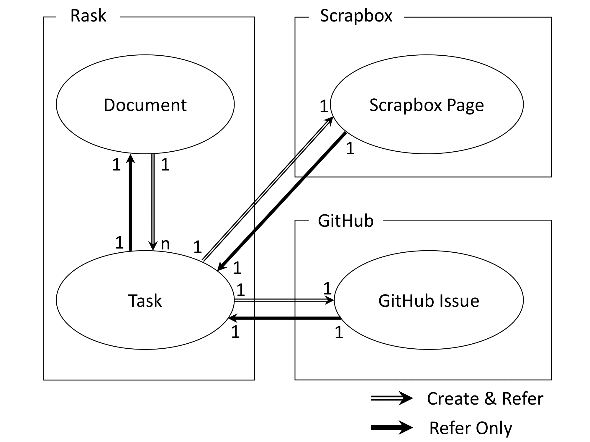

# Raskと外部サービス間の連携機能
## Context and scope
(この章では，システムの概要と実装状況を示す．)

Raskとは，乃村研究室で開発しているTODO管理サービスである．
Raskを使うことで，Markdown形式でのDocument作成，GTDに準じたTask管理ができる．

- 実装されている機能: Document(議事録など)，Taskの作成
- 実装予定の機能: DocumentとTaskの連携，Raskと外部サービスの連携

## Goals and non-goals
(この章では，システムの目標および非目標を示す．非目標とは，合理的に目標となる可能性があるがあえて目標としないもの)

Raskの連携機能に関する要件
- Documentに記述されている「宿題記法」からTaskを作成できる
- TaskからScrapboxのページを作成できる
- TaskからGitHubのIssueを作成できる

## The actual design
(この章では，システムの概要から詳細までを示す．とくに設計の際のトレードオフを書き残す．)

### System-context-diagram

#### Document，Task間のリレーションシップ
  - Documentは「宿題記法」に対応するTaskを作成，および作成したTaskを参照できる(1:n)
  - Taskは作成元のDocumentを参照できる(1:1)
#### Task, Scrapbox Page間のリレーションシップ
  - Taskは自身に対応するScrapbox Pageを作成，および作成したScrapbox Pageを参照できる(1:1)
  - Scrapbox Pageは作成元のTaskを参照できる(1:1)
#### Task, GitHub Issue間のリレーションシップ
  - Taskは自身に対応するGitHub Issueを作成，および作成したGitHub Issueを参照できる(1:1)
  - GitHub Issueは作成元のTaskを参照できる(1:1)

### APIs
### Data storage
#### ActionItem
  ActionItemテーブルは，Documentの「宿題記法」からTaskへの遷移を管理している．
  - ActionItemのレコードは「宿題記法」毎に生成され，対応するTaskへのパスを持つ．
  - 「宿題記法」を経由して作成されたTaskは，参照元の文書へのリンクを持つ．

### Code and pseudo-code
### Degree of constraint

## Alternatives considered
(この章では，代替となる設計リストを示す．)

#### Scrapbox PageとGitHub Issue間の相互参照について
現在の仕様では，Scrapbox PageとGitHub Issue間の参照関係は考慮されていない．
しかし，Task, Scrapbox Page, GitHub Issueはすべて1対1関係にあるため，ユースケースによっては実装を検討する必要がある．

## Cross-cutting conserns
(この章では，セキュリティやプライバシーなどの懸念事項を示す．)

## 参考文献
Design Docs at Google:
https://www.industrialempathy.com/posts/design-docs-at-google/
